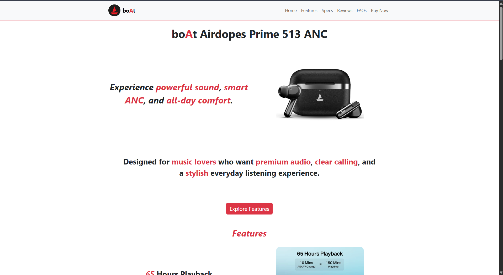
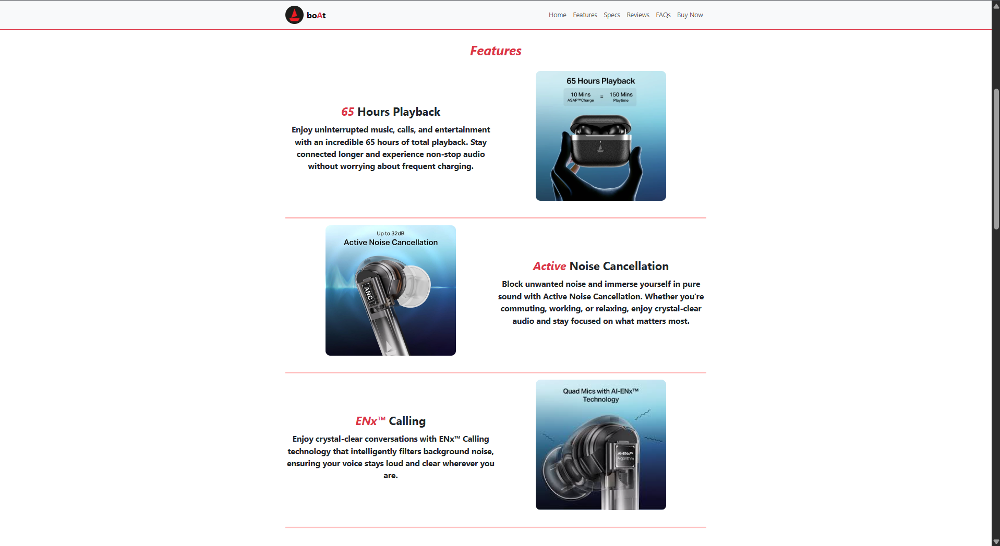
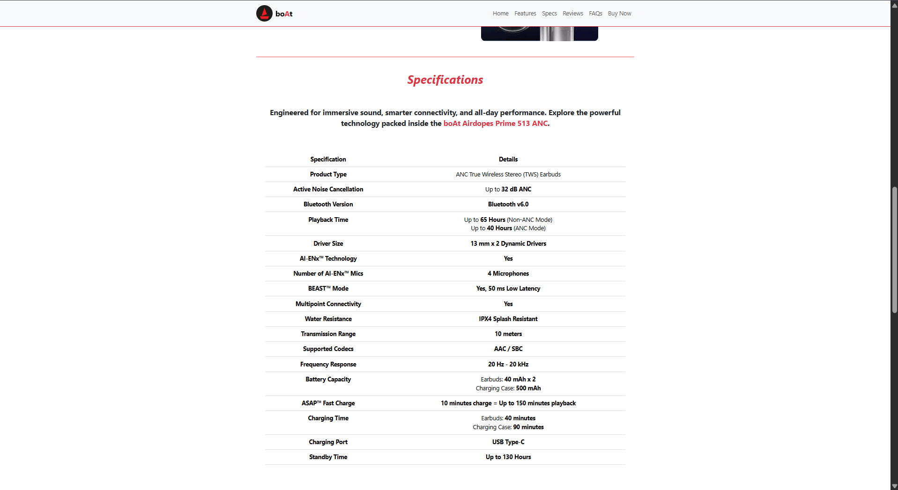
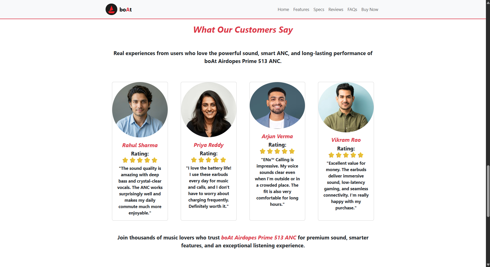
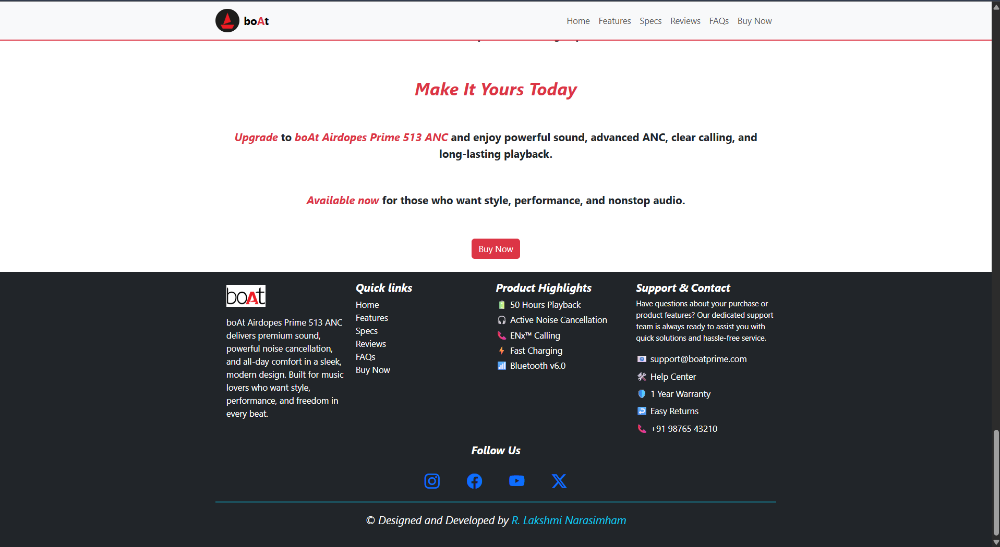
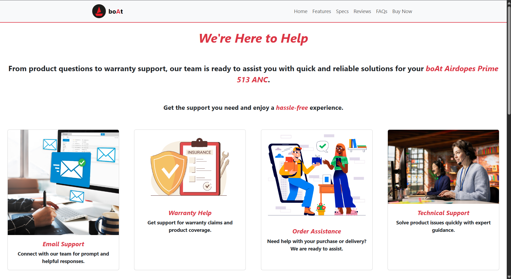

# BOAT AIRDOPES PRIME 513 ANC – Product Landing Page

---

# Project Overview

The **BOAT AIRDOPES PRIME 513 ANC Landing Page** is a responsive product showcase website developed using **HTML5, CSS3, Bootstrap 5, and Bootstrap Icons**. The project presents the BOAT Airdopes Prime 513 ANC wireless earbuds through a clean and modern user interface.

The landing page highlights the product's key features, technical specifications, customer testimonials, and a call-to-action section. It also includes a dedicated **Contact Support** page where users can submit support requests through a responsive form.

The project is designed with a mobile-first approach to provide a consistent browsing experience across desktop, tablet, and mobile devices.

---

# Tech Stack

### Frontend
- HTML5
- CSS3
- Bootstrap 5
- Bootstrap Icons

### Tools
- Visual Studio Code
- Google Chrome (Browser Testing)

---

# Features in the Project

- Responsive product landing page
- Modern Bootstrap-based user interface
- Hero section introducing the product
- Product feature highlights
- Product specifications section
- Customer testimonials section
- Call-to-action section
- Contact Support page
- Support request form
- Responsive navigation bar
- Footer with useful information
- Mobile-friendly layout
- Bootstrap Icons integration
- Optimized product images and assets

---

# Role in this Project

**Frontend Developer**

### Responsibilities

- Designed and developed the complete responsive landing page.
- Built the user interface using HTML5, CSS3, and Bootstrap 5.
- Created reusable and responsive page layouts.
- Implemented product showcase sections including Hero, Features, Specifications, Testimonials, and Call-to-Action.
- Developed the Contact Support page with a responsive contact form.
- Integrated Bootstrap Icons to enhance the user interface.
- Optimized the layout for desktop, tablet, and mobile devices.
- Organized project assets and maintained a clean project structure.

---

# Screenshots of Different Web Pages in the Project

## Home Page

---

## Features Section

---

## Specifications Section

---

## Customer Testimonials Section

---

## Call-to-Action Section

---

## Contact Support Page

